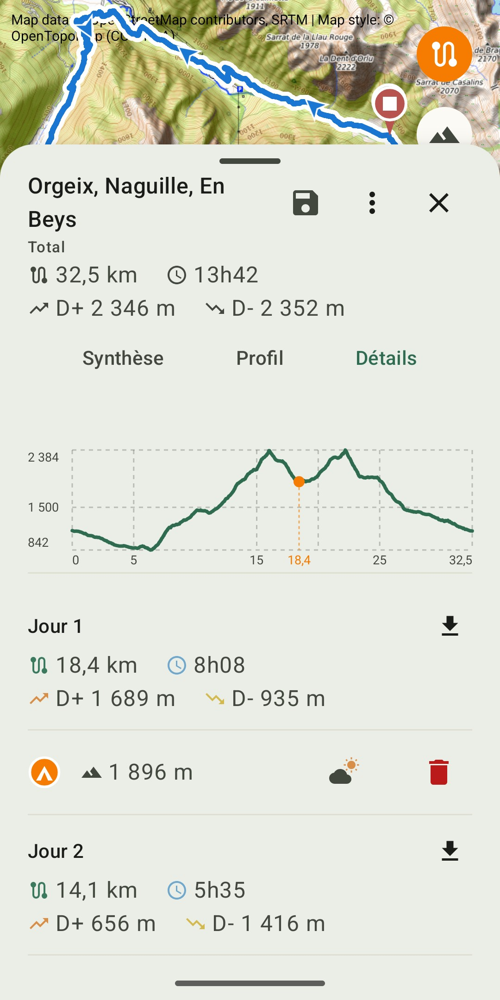
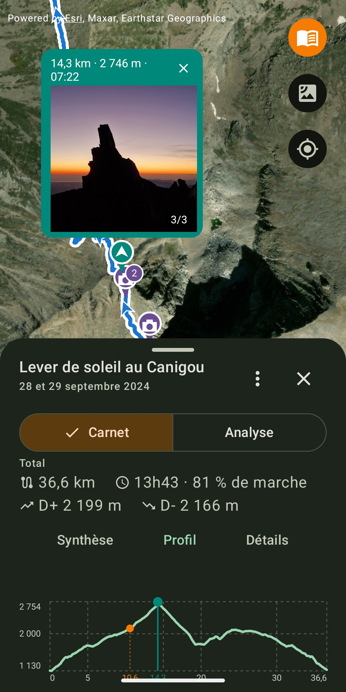

# Bivouac

*[English version](README.md)*

**Planifier ses randonnées itinérantes. Revivre et analyser celles déjà faites.**

Application Android libre. Bivouac découpe une trace GPX en étapes autour des points de bivouac,
puis conserve chaque sortie dans un journal, avec ses photos et ses chiffres.

Présentation, captures, installation et questions fréquentes : **[bivouac.rseb.net](https://bivouac.rseb.net/fr/)**

<table>
  <tr>
    <td width="50%" align="center">
      <br>
      <sub>Planifier : les étapes autour du bivouac</sub>
    </td>
    <td width="50%" align="center">
      <br>
      <sub>Revivre : les photos placées sur la trace</sub>
    </td>
  </tr>
</table>

## Fonctions

- **Planification** : import GPX (sélecteur de fichiers ou partage depuis une autre app), banque
  de traces, bivouacs aimantés au tracé avec altitude et lien météo, étapes recalculées
  (distance, dénivelé, durée estimée), export GPX d'une étape
- **Journal** : sorties d'un ou plusieurs jours (plusieurs fichiers importés ensemble), note,
  tags, photos placées sur la trace par leur GPS ou leur heure de prise de vue, recadrage non
  destructif, deux modes de stockage des photos
- **Analyse** : coloration par forme, pente ou vitesse ; profil en distance ou en durée ; durée
  réelle comparée à l'estimation, temps de marche et pauses ; déroulé de la sortie, nuits au
  bivouac comprises
- **Bilan** : totaux, progression mensuelle, records personnels, avec durée réelle et part de
  marche
- **Réglages** : vitesse de marche et pénalité de dénivelé manuelles ou calculées sur le Journal,
  sauvegarde et restauration complètes, désactivation des services non libres

Interface en anglais (par défaut) et en français, selon la langue de l'appareil ou la langue par
application (Android 13 et plus). Android 8 et plus récent.

Historique des versions et limites connues : [RELEASE_NOTES.fr.md](RELEASE_NOTES.fr.md).

## Installation

APK signé par le développeur dans les [Releases](https://github.com/sebastienraison/Bivouac/releases/latest).
Les autres canaux (F-Droid, Google Play) sont indiqués sur le [site](https://bivouac.rseb.net/fr/).

## Confidentialité

Pas de compte, pas de statistiques d'usage, pas de traceur. Seule connexion réseau : le
téléchargement des fonds de carte. Détails : [politique de confidentialité](https://bivouac.rseb.net/fr/privacy).

## Stack technique

- Kotlin, Jetpack Compose (Material3), architecture MVVM (StateFlow)
- Room et DataStore pour le stockage local
- [osmdroid](https://github.com/osmdroid/osmdroid) pour la cartographie OSM
- [JPX](https://github.com/jenetics/jpx) pour la lecture des traces GPX

## Compiler depuis les sources

```bash
./gradlew assembleDebug
```

Nécessite un SDK Android (API 37) et un JDK 17.

Les versions publiées sont reproductibles : sans la clé du développeur, `./gradlew assembleRelease`
produit un APK non signé identique, signature mise à part, à celui des Releases.

## Licence

Ce projet est distribué sous licence [GPLv3](LICENSE).

## Pourquoi open source ?

Ce projet a démarré comme un outil perso pour ne plus perdre mes bivouacs sur un coin de carte, et
il a pris de l'ampleur sans prévenir. Ne vous attendez pas à du code exemplaire, mais ça tourne,
et si ça peut servir à quelqu'un d'autre, tant mieux. Indulgence et retours bienvenus.

## Développement

Code écrit avec l'assistance d'un modèle d'IA.
