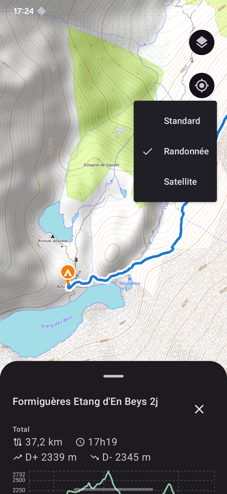
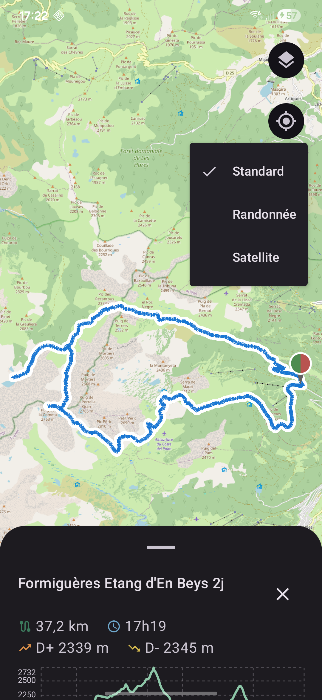
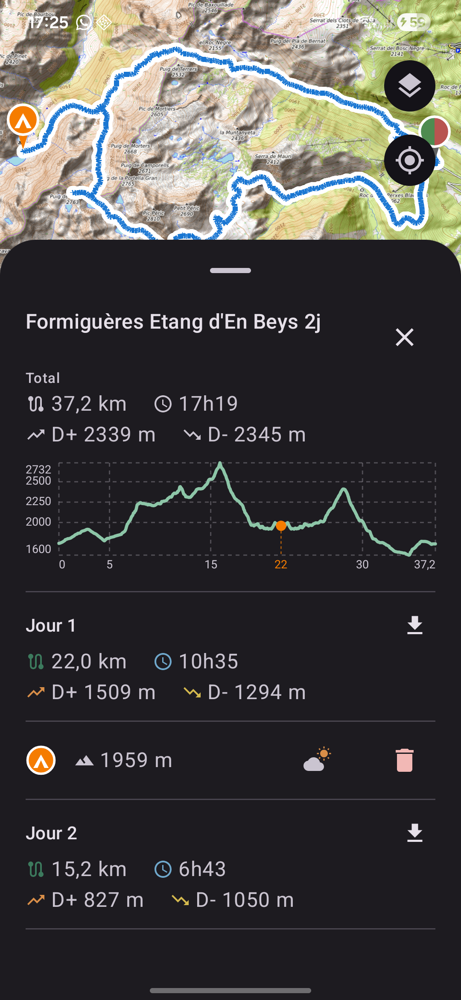

# Bivouac

Application Android open source pour la préparation de randonnées itinérantes avec bivouac.

Importe une trace GPX multi-jours, affiche-la sur une carte OSM, positionne tes points de
bivouac directement sur le tracé, et récupère un tableau des segments journaliers (distance,
dénivelé, durée estimée) qui se met à jour automatiquement.





## Fonctionnalités (V1.1)

- Import d'une trace GPX via le sélecteur de fichiers système, ou directement depuis une autre
  application
- Affichage sur fond de carte OSM (osmdroid) avec sélecteur (standard, randonnée, satellite),
  pictos de départ/arrivée/boucle, recentrage sur la trace
- Ajout, déplacement (aimanté à la trace) et suppression des points de bivouac ; altitude et lien
  météo pour chaque point
- Courbe de dénivelé avec repères d'altitude/distance et position des bivouacs
- Tableau des segments journaliers : distance, durée estimée, D+, D-
- Export d'un segment au format GPX vers une autre application

Détail complet des fonctionnalités et limitations connues : [RELEASE_NOTES.md](RELEASE_NOTES.md).

## FAQ

### L'appli fonctionne-t-elle sans réseau ?

Oui, en partie. Les fonds de carte déjà consultés restent disponibles hors connexion : dès qu'une
zone a été affichée une fois (par exemple en préparant ta rando chez toi), ses tuiles restent en
cache sur le téléphone et se rechargent sans réseau. C'est pratique une fois sur le terrain, là où
tu n'as souvent plus de réseau mobile — tu peux revoir la carte des zones déjà consultées, positionner
ou ajuster tes bivouacs, sans avoir besoin de connexion. Seules les zones jamais affichées auparavant
resteront vides tant que tu n'as pas de réseau.

### Pourquoi le mode Auto/Sélection de vitesse personnalisée demande-t-il au moins 2 randonnées ?

Bivouac peut calculer automatiquement ta vitesse de marche à plat et ta pénalité de dénivelé à
partir de tes randonnées déjà présentes dans le Journal, plutôt que de te demander de les saisir
toi-même. Ce calcul répartit le temps mis sur une rando entre deux facteurs distincts — la distance
parcourue à plat, et le dénivelé grimpé — un peu comme résoudre une équation à deux inconnues. Avec
une seule randonnée, il n'y a pas assez d'information pour les séparer : impossible de savoir si tu
as mis du temps parce que le terrain était plat mais long, ou court mais très pentu. Il faut au
moins deux randonnées différentes pour que le calcul ait un sens — c'est pourquoi les modes Auto et
Sélection restent grisés tant que ton Journal (ou ta sélection de traces) n'en contient pas au moins
deux.

### Une trace très volumineuse peut-elle poser problème ?

Oui, potentiellement, sur certaines versions d'Android plus anciennes : une trace très volumineuse
(une rando de plusieurs heures avec un relevé GPS très dense) peut dépasser une limite technique
interne (environ 2 Mo par ligne de base de données) au moment d'être lue. Le calcul automatique de
vitesse (mode Auto/Sélection) gère déjà ce cas proprement : une trace trop volumineuse en est
simplement exclue, sans planter — rien n'est perdu, elle reste dans le Journal, juste ignorée pour
ce calcul-là. En revanche, **ouvrir directement une trace de ce gabarit dans le Journal n'a pas
encore le même filet** : ça peut faire planter l'application. Comportement observé en émulation
(Android 14) mais pas reproduit sur un appareil réel plus récent (Android 16) — le risque dépend
surtout de l'ancienneté du téléphone et de la densité du relevé GPS. Limitation connue, correctif
plus général pas encore fait (suivi dans le suivi de projet interne, pas dans ce dépôt).

## Stack technique

- Kotlin + Jetpack Compose (Material3)
- [osmdroid](https://github.com/osmdroid/osmdroid) pour la cartographie OSM
- [JPX](https://github.com/jenetics/jpx) pour la lecture des traces GPX
- Architecture MVVM (StateFlow)

## Compiler depuis les sources

```bash
./gradlew assembleDebug
```

Nécessite un SDK Android (API 34) et un JDK 17.

## Licence

Ce projet est distribué sous licence [GPLv3](LICENSE).

## Pourquoi open source ?

Ce projet a démarré comme un outil perso pour ne plus perdre mes bivouacs sur un coin de carte, et
il a pris de l'ampleur sans prévenir. Ne vous attendez pas à du code exemplaire, mais ça tourne —
et si ça peut servir à quelqu'un d'autre, tant mieux. Indulgence et retours bienvenus.

## Statut

V1.1 fonctionnelle. Développement actif.

## Développement

Code écrit avec l'assistance d'un modèle d'IA.
