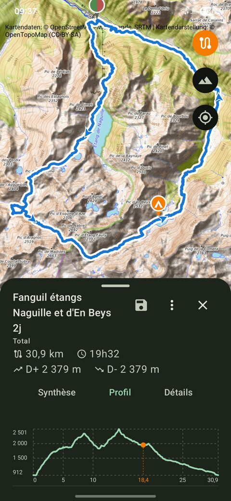
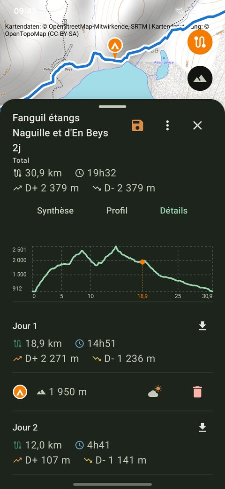
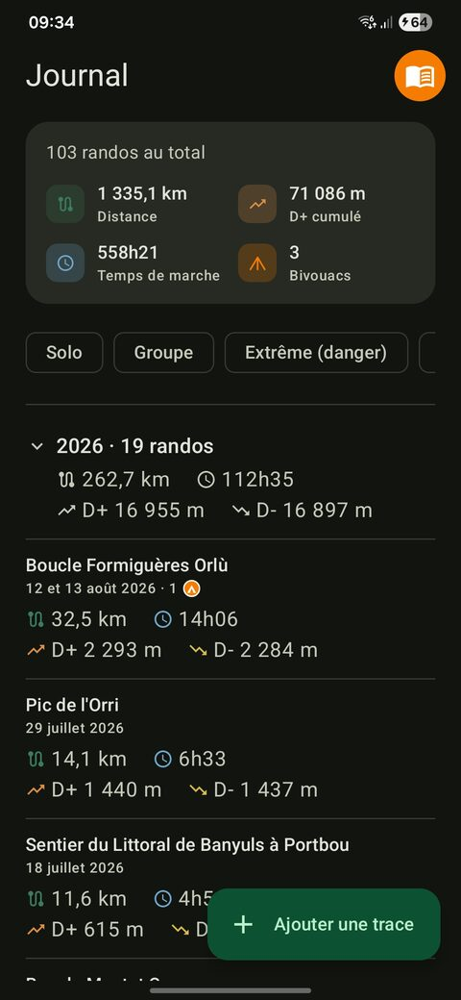
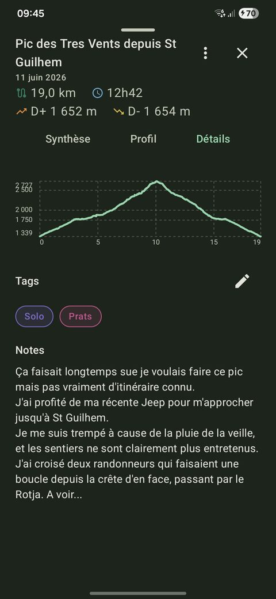
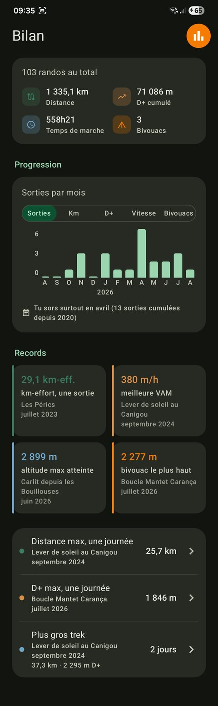
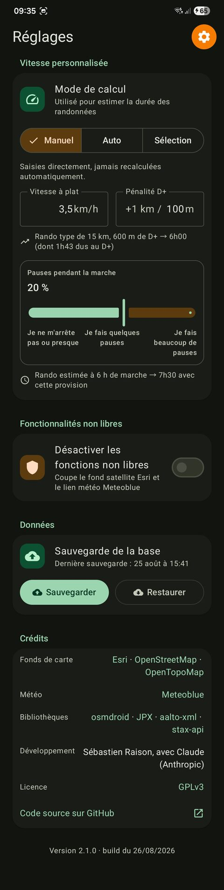

# Bivouac

Application Android open source pour la préparation et le journal de randonnées itinérantes avec bivouac.

Prépare tes randonnées itinérantes (Planification) et garde la trace de celles déjà réalisées
(Journal), avec tes points de bivouac positionnés sur une carte OSM et un tableau des segments
journaliers (distance, dénivelé, durée estimée) qui se met à jour automatiquement.

<table>
  <tr>
    <td width="50%" align="center">
      <br>
      <sub>Planification — trace sur fond de carte, profil altimétrique</sub>
    </td>
    <td width="50%" align="center">
      <br>
      <sub>Planification — détail des segments par jour</sub>
    </td>
  </tr>
  <tr>
    <td width="50%" align="center">
      <br>
      <sub>Journal — liste chronologique par année</sub>
    </td>
    <td width="50%" align="center">
      <br>
      <sub>Journal — détail d'une trace, tags et note</sub>
    </td>
  </tr>
  <tr>
    <td width="50%" align="center">
      <br>
      <sub>Bilan — totaux, progression et records</sub>
    </td>
    <td width="50%" align="center">
      <br>
      <sub>Réglages — vitesse personnalisée et sauvegarde</sub>
    </td>
  </tr>
</table>

## Fonctionnalités (V2.1.0)

**Planification :**

- Import d'une trace GPX via le sélecteur de fichiers système, ou directement depuis une autre
  application ; banque de traces (enregistrer, renommer, dupliquer, supprimer, lister)
- Affichage sur fond de carte OSM (osmdroid) avec sélecteur (standard, randonnée, satellite),
  pictos de départ/arrivée/boucle, recentrage sur la trace
- Ajout, déplacement (aimanté à la trace) et suppression des points de bivouac ; altitude et lien
  météo pour chaque point
- Courbe de dénivelé avec repères d'altitude/distance et position des bivouacs
- Tableau des segments journaliers : distance, durée estimée, D+, D-
- Export d'un segment au format GPX vers une autre application

**Journal :**

- Importer une ou plusieurs traces GPX déjà réalisées (fichiers multiples reconnus comme les jours
  d'une même sortie), liste chronologique par année, détail en lecture seule avec carte et profil
- Note libre et tags par trace, filtrage par tag ; dupliquer une trace du Journal vers Planification

**Bilan :**

- Totaux cumulés, graphique de progression mensuelle (sorties, km, D+, vitesse, bivouacs) sur tout
  l'historique, et records personnels (km-effort, vitesse ascensionnelle, altitude atteinte, bivouac
  le plus haut, plus gros trek...) renvoyant chacun vers la sortie du Journal concernée

**Réglages :**

- Vitesse personnalisée pour l'estimation de durée (manuelle, automatique, ou par sélection de
  traces), sauvegarde et restauration complètes des données, activation/désactivation des
  fonctionnalités non libres

Détail complet des fonctionnalités par version, et limitations connues : [RELEASE_NOTES.md](RELEASE_NOTES.md).

## FAQ

### L'appli fonctionne-t-elle sans réseau ?

Oui, en partie. Les fonds de carte déjà consultés restent disponibles hors connexion : dès qu'une
zone a été affichée une fois (par exemple en préparant ta rando chez toi), ses tuiles restent en
cache sur le téléphone et se rechargent sans réseau. C'est pratique une fois sur le terrain, là où
tu n'as souvent plus de réseau mobile — tu peux revoir la carte des zones déjà consultées, positionner
ou ajuster tes bivouacs, sans avoir besoin de connexion. Seules les zones jamais affichées auparavant
resteront vides tant que tu n'as pas de réseau.

### Pourquoi le mode Auto/Sélection de vitesse personnalisée demande-t-il au moins 2 randonnées ?

Bivouac peut calculer automatiquement ta vitesse de marche à plat et ta pénalité de dénivelé à
partir de tes randonnées déjà présentes dans le Journal, plutôt que de te demander de les saisir
toi-même. Ce calcul répartit le temps mis sur une rando entre deux facteurs distincts — la distance
parcourue à plat, et le dénivelé grimpé — un peu comme résoudre une équation à deux inconnues. Avec
une seule randonnée, il n'y a pas assez d'information pour les séparer : impossible de savoir si tu
as mis du temps parce que le terrain était plat mais long, ou court mais très pentu. Il faut au
moins deux randonnées différentes pour que le calcul ait un sens — c'est pourquoi les modes Auto et
Sélection restent grisés tant que ton Journal (ou ta sélection de traces) n'en contient pas au moins
deux.

### Comment le calcul automatique de vitesse fonctionne-t-il, et pourquoi peut-il être optimiste ?

Plutôt que de faire une moyenne globale par rando, Bivouac découpe chacune de tes randonnées en
petits tronçons pour séparer ce qui relève de l'allure à plat de ce qui relève du dénivelé — plus
précis qu'une simple moyenne, surtout si tes randos varient beaucoup en profil. Les moments passés
à l'arrêt (pause, photo, casse-croûte) sont automatiquement écartés de ce calcul, pour qu'une longue
pause ne fasse pas croire que tu marches lentement.

Ce même souci de précision explique un choix qui peut surprendre : la pénalité de dénivelé ne
distingue pas montée et descente. Sur des boucles (l'immense majorité des randos), les deux sont si
étroitement corrélées qu'un facteur séparé n'apporterait aucune précision réelle, juste du bruit
statistique sur un chiffre supplémentaire — mieux vaut un seul facteur robuste que deux
approximatifs.

Pour la marge de pause justement : les Réglages (Vitesse personnalisée) proposent un curseur dédié
qui ajoute une provision de temps aux estimations, réglable manuellement ou mesurée automatiquement
sur le Journal/la sélection selon le mode choisi — sans lui, les estimations tendent à être
optimistes, l'écart grandissant avec le nombre de pauses prévisibles.

### Mes randonnées partent-elles dans une sauvegarde cloud Google ?

Bivouac est 100 % local, modulo les sauvegardes du système : l'app elle-même n'envoie rien nulle
part de son propre chef, mais elle ne s'exclut pas non plus de la sauvegarde automatique standard
d'Android (base de données et préférences incluses), comme la quasi-totalité des apps qui ne
s'en excluent pas explicitement. Concrètement, si la sauvegarde automatique est activée sur ton
compte Google, tes randos, tags et notes en font partie ; sur un appareil sans compte/services
Google (dont beaucoup de configurations F-Droid), ce mécanisme est simplement inactif et ne fait
rien. Le transfert direct d'un téléphone à l'autre (câble ou outil de transfert du fabricant) reste
complet dans tous les cas. La sauvegarde explicite (Réglages → Sauvegarder, vers l'endroit de ton
choix) reste le mécanisme à utiliser volontairement si tu veux un filet en dehors de ces deux
canaux, notamment avant une réinstallation ou un test.

## Stack technique

- Kotlin + Jetpack Compose (Material3)
- [osmdroid](https://github.com/osmdroid/osmdroid) pour la cartographie OSM
- [JPX](https://github.com/jenetics/jpx) pour la lecture des traces GPX
- Architecture MVVM (StateFlow)

## Compiler depuis les sources

```bash
./gradlew assembleDebug
```

Nécessite un SDK Android (API 34) et un JDK 17.

## Licence

Ce projet est distribué sous licence [GPLv3](LICENSE).

## Pourquoi open source ?

Ce projet a démarré comme un outil perso pour ne plus perdre mes bivouacs sur un coin de carte, et
il a pris de l'ampleur sans prévenir. Ne vous attendez pas à du code exemplaire, mais ça tourne —
et si ça peut servir à quelqu'un d'autre, tant mieux. Indulgence et retours bienvenus.

## Statut

V2.1.0 fonctionnelle. Développement actif.

## Développement

Code écrit avec l'assistance d'un modèle d'IA.
