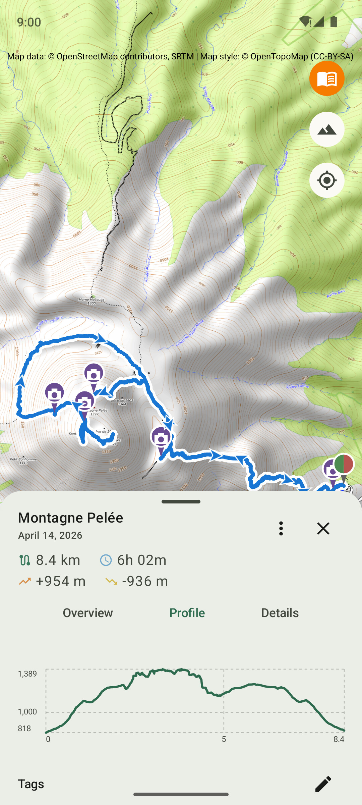
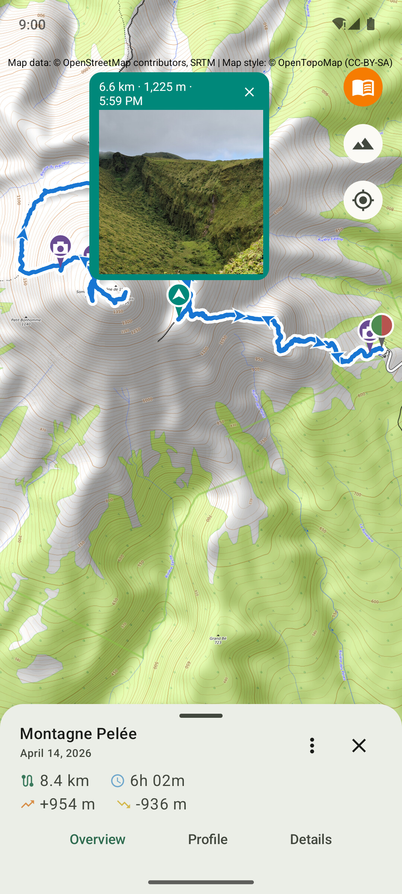
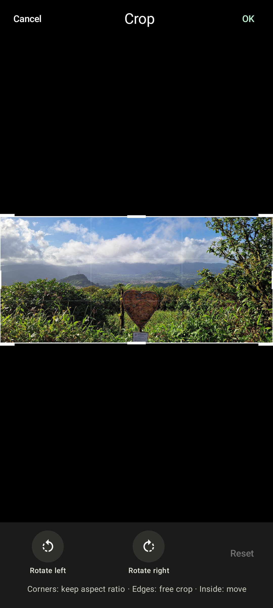
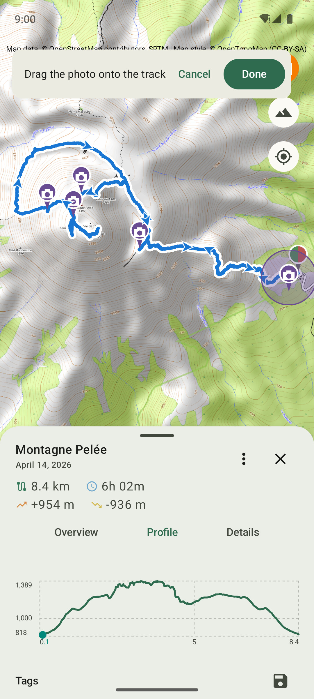
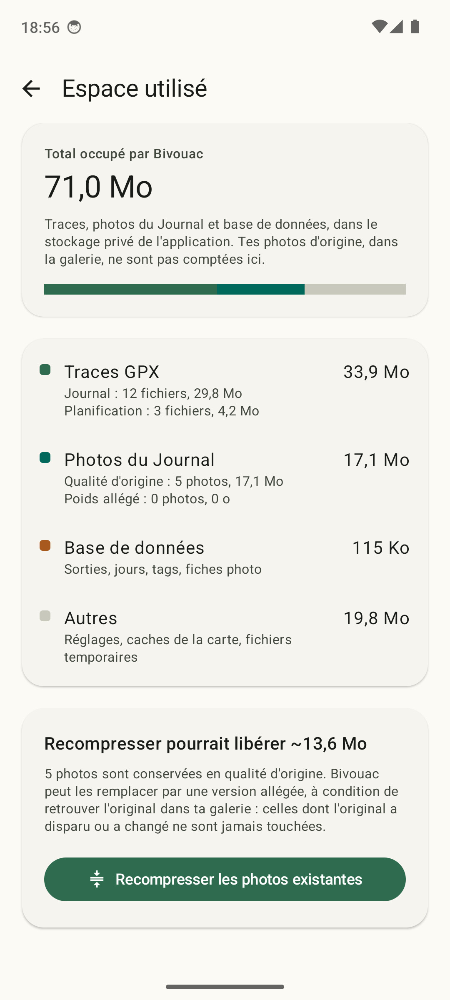

# Bivouac

*[Version française](README.fr.md)*

Open source Android app for planning and logging multi-day hikes with wild-camping (bivouac) stops.

Plan your multi-day hikes (Planning) and keep a log of the ones you've already done (Journal),
with your bivouac points placed on an OSM map and a table of daily segments (distance, elevation
gain, estimated duration) that updates automatically.

Available in English (default) and French, following the device's language (or the per-app
language setting on Android 13+). No in-app language switch. Numbers, dates and durations follow
the system locale.

<table>
  <tr>
    <td width="50%" align="center">
      <br>
      <sub>Planning: track on the map, elevation profile</sub>
    </td>
    <td width="50%" align="center">
      <br>
      <sub>Planning: daily segment detail</sub>
    </td>
  </tr>
  <tr>
    <td width="50%" align="center">
      <br>
      <sub>Journal: chronological list by year</sub>
    </td>
    <td width="50%" align="center">
      <br>
      <sub>Journal: hike detail, photos, tags and note</sub>
    </td>
  </tr>
  <tr>
    <td width="50%" align="center">
      <br>
      <sub>Journal: photos placed on the track</sub>
    </td>
    <td width="50%" align="center">
      <br>
      <sub>Journal: photo bubble, distance, altitude and caption</sub>
    </td>
  </tr>
  <tr>
    <td width="50%" align="center">
      <br>
      <sub>Journal: Crop, non-destructive rotation and cropping</sub>
    </td>
    <td width="50%" align="center">
      <br>
      <sub>Journal: reposition a photo along the track</sub>
    </td>
  </tr>
  <tr>
    <td width="50%" align="center">
      <br>
      <sub>Stats: totals, progression and records</sub>
    </td>
    <td width="50%" align="center">
      <br>
      <sub>Settings: Journal photos, storage mode</sub>
    </td>
  </tr>
  <tr>
    <td width="50%" align="center">
      <br>
      <sub>Settings: storage used, photo recompression</sub>
    </td>
    <td width="50%"></td>
  </tr>
</table>

## Features (V2.4.0)

**Planning:**

- Import a GPX track via the system file picker, or directly from another app; a track bank
  (save, rename, duplicate, delete, list)
- Display on an OSM map (osmdroid) with a layer switch (Standard, Hiking, Satellite), start/
  end/loop icons, recenter on the track
- Add, move (snapped to the track) and remove bivouac points; altitude and a weather link for
  each point
- Elevation profile with altitude/distance markers and bivouac positions
- Daily segment table: distance, estimated duration, ascent, descent
- Export a segment as a GPX file to another app

**Journal:**

- Import one or more already-hiked GPX tracks (multiple files selected together are recognized
  as the days of a single hike), chronological list by year, read-only detail with map and
  elevation profile
- Free-text note and tags per hike, filter by tag; duplicate a hike from Journal to Planning
- Photos attached to a hike: placed on the track from their GPS data, markers on the map,
  carousel in the bubble, per-hike gallery and full-screen viewer; can be turned off in Settings
  (see the FAQ for permissions)
- Photo editing: non-destructive rotation and crop, caption, reposition by dragging along the
  track, restore to GPS position, hide from map, show on map again; enlarge candidates before
  import
- Two photo storage modes: "Original quality" or "Lightweight" (reduced to 2048 px, about ten
  times smaller), recompression of the existing photos, storage usage screen (see the FAQ)

**Stats:**

- Cumulative totals, monthly progression chart (hikes, distance, ascent, speed, bivouacs) across
  your whole history, and personal records (km-effort, climbing speed, highest point reached,
  highest bivouac, longest trek...), each linking back to the relevant hike in the Journal

**Settings:**

- Custom speed for duration estimates (manual, automatic, or from a selection of hikes), full
  backup and restore, enabling/disabling the non-free features and photo management, photo
  storage mode, storage used, purge imported photos

Full feature history by version, and known limitations: [RELEASE_NOTES.md](RELEASE_NOTES.md)
([version française](RELEASE_NOTES.fr.md)).

## FAQ

### Does the app work offline?

Yes, partly. Map tiles already viewed stay available offline: once an area has been displayed
once (for example while planning a hike at home), its tiles stay cached on the phone and reload
without a network. That's useful once you're out there, where you often have no mobile network
left: you can still view the map of areas already seen, and place or adjust your bivouac points
without a connection. Only areas never displayed before stay blank until you have a network
again.

### Why does the Auto/Selection custom speed mode need at least 2 hikes?

Bivouac can compute your flat-ground walking speed and your elevation-gain penalty automatically
from the hikes already in your Journal, instead of asking you to enter them yourself. This
calculation splits the time spent on a hike between two separate factors, the flat-ground
distance covered and the elevation climbed, a bit like solving an equation with two unknowns.
With a single hike, there isn't enough information to separate them: there's no way to tell
whether you took longer because the terrain was flat but long, or short but very steep. At least
two different hikes are needed for the calculation to make sense, which is why the Auto and
Selection modes stay greyed out until your Journal (or your track selection) holds at least two.

### How does the automatic speed calculation work, and why can it be optimistic?

Rather than taking a single average per hike, Bivouac splits each of your hikes into small
segments to separate what comes from flat-ground pace from what comes from elevation gain, which
is more accurate than a simple average, especially if your hikes vary a lot in profile. Time
spent stopped (breaks, photos, snacks) is automatically excluded from this calculation, so a long
break doesn't make it look like you're walking slowly.

This same concern for accuracy explains a choice that can be surprising: the elevation-gain
penalty doesn't distinguish ascent from descent. On loops (the vast majority of hikes), the two
are so closely correlated that a separate factor wouldn't add any real accuracy, just statistical
noise on an extra number: one solid factor beats two approximate ones.

As for the break margin: Settings (Custom speed) offers a dedicated slider that adds a time
allowance to the estimates, adjustable manually or measured automatically from the Journal or the
selection depending on the chosen mode. Without it, estimates tend to be optimistic, and the gap
grows with the number of expected breaks.

### Why does the app ask for both photo access AND their location?

To place a photo on the track, Bivouac needs the GPS position stored in the photo. The standard
Android photo picker, designed so apps only get the bare minimum, actually strips that position
from the photos it hands over. Bivouac therefore uses its own selection screen, which needs two
permissions: reading images (the one any gallery app asks for), and access to media location
(the one that preserves the GPS position). Both are only requested the first time you use the
photo feature, never if you don't use it, and Android 14+'s partial access ("allow only selected
photos") is supported. The feature can be fully turned off in Settings, and photos never leave
the device.

### Original quality or lightweight: which photo storage mode should I choose?

Bivouac keeps its own copy of every photo attached to a hike, so it doesn't depend on the
gallery. In "Original quality", this copy is identical to the photo in the gallery (often 3 to
5 MB per photo). In "Lightweight", it's reduced to 2048 px on the long side, about ten times
smaller, which is still plenty for a phone screen. In that mode, the full-screen viewer looks up
the original in the gallery for as long as it's still there, so nothing is lost on screen. New
installs start in lightweight mode; if you already had photos, the app offers the choice on
first launch, and already-imported photos can be recompressed from Settings afterwards. The
"Storage used" screen in Settings shows what tracks and photos take up.

### Do my hikes go into a Google cloud backup?

Bivouac is 100% local, aside from the system's own backups: the app itself never sends anything
anywhere on its own, but it doesn't exclude itself from Android's standard automatic backup
either (database and preferences included), like most apps that don't explicitly opt out.
Concretely, if automatic backup is enabled on your Google account, your hikes, tags and notes
are part of it; on a device without a Google account/services (as on many F-Droid setups), this
mechanism is simply inactive and does nothing. A direct phone-to-phone transfer (cable or the
manufacturer's transfer tool) stays complete either way. The explicit backup (Settings > Backup,
to the location of your choice) remains the mechanism to use deliberately if you want a safety
net outside those two channels, especially before a reinstall or a test.

## Tech stack

- Kotlin + Jetpack Compose (Material3)
- [osmdroid](https://github.com/osmdroid/osmdroid) for OSM mapping
- [JPX](https://github.com/jenetics/jpx) for reading GPX tracks
- MVVM architecture (StateFlow)

## Building from source

```bash
./gradlew assembleDebug
```

Requires an Android SDK (API 34) and a JDK 17.

## License

This project is distributed under the [GPLv3](LICENSE) license.

## Why open source?

This project started as a personal tool to stop losing track of my bivouac spots on a corner of
a paper map, and grew from there without much planning. Don't expect exemplary code, but it
works, and if it's useful to someone else, all the better. Feedback and contributions welcome.

## Status

V2.4.0, functional. Active development.

## Development

Code written with the assistance of an AI model.
