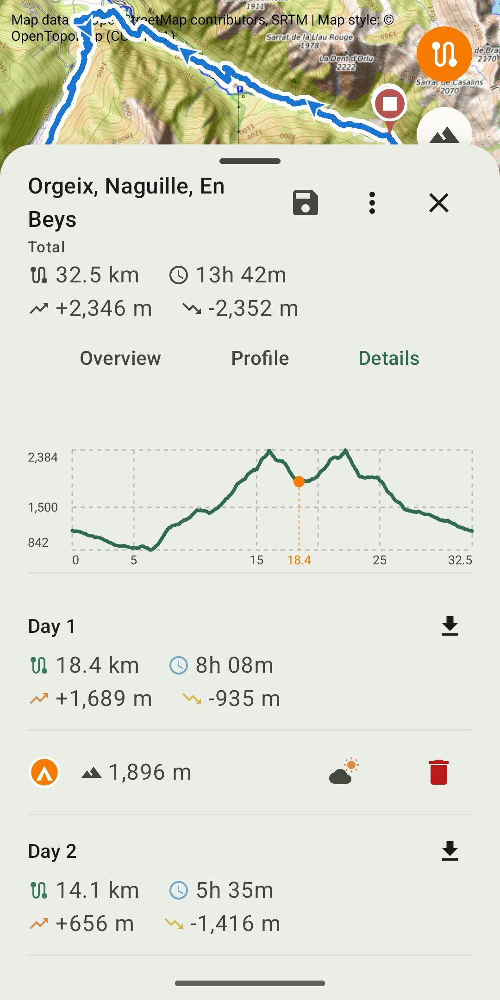
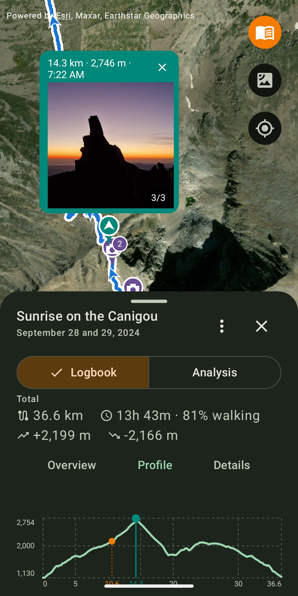

# Bivouac

*[Version française](README.fr.md)*

**Plan multi-day hikes. Relive and analyse the ones already done.**

Free and open source Android app. Bivouac splits a GPX track into stages around bivouac spots,
then keeps every outing in a journal, with its photos and its figures.

Overview, screenshots, installation and FAQ: **[bivouac.rseb.net](https://bivouac.rseb.net/)**

<table>
  <tr>
    <td width="50%" align="center">
      <br>
      <sub>Plan: stages around the bivouac</sub>
    </td>
    <td width="50%" align="center">
      <br>
      <sub>Relive: photos placed on the track</sub>
    </td>
  </tr>
</table>

## Features

- **Planning**: GPX import (file picker or sharing from another app), track bank, bivouacs
  snapped to the route with altitude and a weather link, stages recalculated (distance,
  elevation, estimated duration), GPX export of a stage
- **Journal**: hikes of one or several days (several files imported together), note, tags,
  photos placed on the track from their GPS or their capture time, non-destructive crop, two
  photo storage modes
- **Analysis**: colouring by form, slope or speed; profile by distance or by duration; actual
  duration against the estimate, walking time and breaks; timeline of the outing, nights at the
  bivouac included
- **Stats**: totals, monthly progress, personal records, with actual duration and walking share
- **Settings**: walking speed and elevation penalty set by hand or calculated from the Journal,
  full backup and restore, a switch for the non-free services

Interface in English (default) and French, following the device's language or the per-app
language (Android 13 and later). Android 8 and later.

Version history and known limitations: [RELEASE_NOTES.md](RELEASE_NOTES.md).

## Installation

APK signed by the developer in [Releases](https://github.com/sebastienraison/Bivouac/releases/latest).
Other channels (F-Droid, Google Play) are listed on the [website](https://bivouac.rseb.net/).

## Privacy

No account, no usage statistics, no tracker. The only network connection: downloading map
tiles. Details: [privacy policy](https://bivouac.rseb.net/privacy).

## Tech stack

- Kotlin, Jetpack Compose (Material3), MVVM architecture (StateFlow)
- Room and DataStore for local storage
- [osmdroid](https://github.com/osmdroid/osmdroid) for OSM mapping
- [JPX](https://github.com/jenetics/jpx) for reading GPX tracks

## Building from source

```bash
./gradlew assembleDebug
```

Requires the Android SDK (API 37) and JDK 17.

Released builds are reproducible: without the developer's key, `./gradlew assembleRelease`
produces an unsigned APK identical, signature aside, to the one in Releases.

## License

This project is distributed under the [GPLv3](LICENSE) license.

## Why open source?

This project started as a personal tool to stop losing track of my bivouac spots on a corner of
a paper map, and grew from there without much planning. Don't expect exemplary code, but it
works, and if it's useful to someone else, all the better. Feedback and contributions welcome.

## Development

Code written with the assistance of an AI model.
